# Mood Maestro 🎼

### An AI-powered, agentic music recommendation system that understands your vibe.

[](https://www.python.org/)
[](https://fastapi.tiangolo.com/)
[](https://github.com/astral-sh/ruff)
[](LICENSE)

Mood Maestro is a sophisticated music recommendation engine that goes beyond simple playlists. It leverages a multi-agent AI system, powered by Microsoft AutoGen, to interpret natural language queries, construct complex database searches, and deliver a highly personalized and context-aware ranking of songs.

---
## Key Features 🚀

* **🧠 Agentic AI Core:** Utilizes a multi-agent system (Planner, Worker, Executor) built with **Microsoft AutoGen**. The agents collaborate to deconstruct user queries, form a plan, and execute it by calling specialized tools.
* **🔍 Hybrid Search Engine:** Implements a two-stage search process in **MongoDB Atlas**, combining efficient lexical pre-filtering with powerful semantic vector search to find the most relevant tracks.
* **⚖️ Dynamic Multi-Faceted Ranking:** Ranks tracks using a dynamic weighting of four key scores. The weights are determined **in real-time by an LLM (Azure OpenAI)** based on the nuances of the user's query.
    * **Similarity Score:** Cosine similarity from vector search.
    * **Personalization Score:** Affinity to the user's unique listening profile.
    * **Re-engagement Score:** A custom algorithm to resurface skipped songs at the right time.
    * **Popularity Score:** Mainstream appeal of the track.
* **🏛️ Scalable and Decoupled Architecture:** Built with a clean **Separation of Concerns** between the **FastAPI** web layer and the core AI logic, ensuring the system is maintainable, testable, and scalable.

---
## System Architecture

The project follows a modular, service-oriented architecture designed for clarity and scalability. The web layer is completely decoupled from the AI logic layer, which communicates with external services.

```mermaid
graph TD
    subgraph "User"
        Client([Client])
    end

    subgraph "Web Layer (FastAPI)"
        A[FastAPI Endpoint<br>/recommendations]
        B[Service Layer<br>services.py]
    end

    subgraph "AI Logic Layer (AutoGen)"
        C[Agent Manager<br>agent_manager.py]
        D{Group Chat}
        E[Planner Agent]
        F[MusicQuery Agent]
        G[CodeExecutor Agent]
    end
    
    subgraph "Tools & External Services"
        H[🛠️ Agent Tools<br>tools.py]
        I["🤖 Azure OpenAI"]
        J["🗄️ MongoDB Atlas"]
    end

    Client -- HTTP POST --> A
    A -- calls function --> B
    B -- triggers workflow --> C
    C -- initiates --> D
    D <--> E
    D <--> F
    D <--> G
    G -- executes code --> H
    H -- calls --> I
    H -- calls --> J
```


---
## Tech Stack 🔧
* **Backend:** FastAPI, Pydantic, Uvicorn
* **AI & ML:** Microsoft AutoGen, OpenAI (via Azure), NumPy
* **Database:** MongoDB Atlas (Vector Search, Aggregation Pipelines), PyMongo
* **Dev & Tooling:** uv (Package Management), Ruff (Linting/Formatting), Pytest, Docker & Azure Kubernetes Service (Containerization & Deployment)

---
## Getting Started
Follow these instructions to set up and run the project locally.

### 1. Prerequisites
* Python 3.11+
* `uv` installed (`pip install uv`)
* Access to a MongoDB Atlas cluster with Vector Search enabled.
* Access to an Azure OpenAI deployment.

### 2. Installation & Setup
1.  **Clone the repository:**
    ```bash
    git clone [https://github.com/YOUR_USERNAME/mood-maestro.git](https://github.com/YOUR_USERNAME/mood-maestro.git)
    cd mood-maestro
    ```
2.  **Create a virtual environment and install dependencies:**
    ```bash
    uv venv
    source .venv/bin/activate
    uv pip install -r requirements.txt
    ```
3.  **Configure environment variables:**
    Create a `.env` file in the project root by copying the example file.
    ```bash
    cp .env.example .env
    ```
    Now, fill in the `.env` file with your credentials for MongoDB Atlas and Azure OpenAI.

### 3. Running the Application
Launch the FastAPI server using Uvicorn:
```bash
uvicorn mood_maestro.app.main:app --reload
```

The API will be available at http://127.0.0.1:8000. You can access the interactive documentation at http://127.0.0.1:8000/docs.

---
## API Usage
Replace the localhost IP for your cloud IP if running on cloud

To get a recommendation, send a POST request to the /recommendations endpoint.

Example Request (cURL)
```bash
curl -X 'POST' \
  '[http://127.0.0.1:8000/recommendations](http://127.0.0.1:8000/recommendations)' \
  -H 'accept: application/json' \
  -H 'Content-Type: application/json' \
  -d '{
    "query": "I want to listen to something similar to Bohemian Rhapsody but more upbeat."
  }'
```
Example Response
```
{
  "recommendations": [
    {
      "track_name": "Don't Stop Me Now",
      "score": 0.985
    },
    {
      "track_name": "Killer Queen",
      "score": 0.971
    },
    {
      "track_name": "Somebody to Love",
      "score": 0.966
    }
  ]
}
```
---
## License
Distributed under the MIT License. See `LICENSE` for more information.
